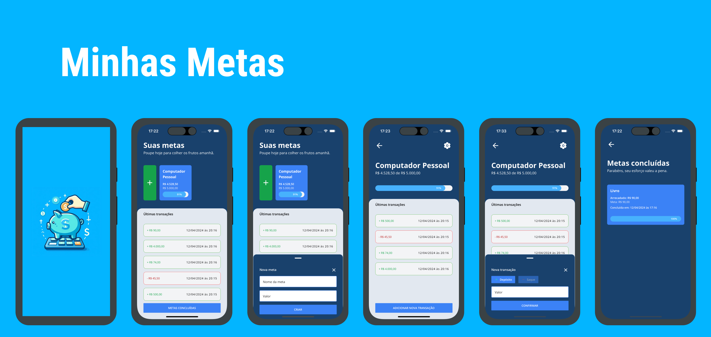

<h1 align="center">
  Minhas Metas
</h1>
<br>

<p align="center">
  <a href="#features">Features</a>&nbsp;&nbsp;&nbsp;|&nbsp;&nbsp;&nbsp;
  <a href="#technologies">Technologies</a>&nbsp;&nbsp;&nbsp;|&nbsp;&nbsp;&nbsp;
  <a href="#getting-started">Getting started</a>&nbsp;&nbsp;&nbsp;|&nbsp;&nbsp;&nbsp;
  <a href="#project">Project</a>&nbsp;&nbsp;&nbsp;|&nbsp;&nbsp;&nbsp;
  <a href="#application">Application</a>
</p>

<br>

<p align="center">
  
</p>

---

## Features

- [x] Goal Creation and Management: Begin by defining your financial goals, whether it’s saving for a vacation, buying a new gadget, or setting aside an emergency fund. Enter your target amount and let Minhas Metas do the rest. You can add or withdraw funds with just a few taps, always keeping you in control and on track.
- [x] Progress Tracking: Watch your savings grow as you inch closer to your financial dreams. Minhas Metas provides you with a dynamic and intuitive interface, where you can see a visual representation of your progress. Each goal is tracked by a progress bar, filling up as you add funds, giving you a clear view of how close you are to achieving your objective.
- [x] Goal Completion and History: Once a goal reaches 100%, it automatically moves to your history of completed goals. This feature allows you to reflect on your successes and the exact date you achieved them, reinforcing your financial discipline and encouraging you to set new goals.
- [x] Easy Editing and Deletion: Made a mistake while setting up your goal? No worries! Minhas Metas allows you to edit the details of your goals or delete them entirely if your plans change. Flexibility is at your fingertips.

## Technologies

This project was developed using the following technologies:

- [React Native](https://reactnative.dev/)
- [Expo bare workflow](https://expo.dev)
- [TypeScript](https://www.typescriptlang.org/)
- [Expo SQLite Next](https://docs.expo.dev/versions/latest/sdk/sqlite-next/)

## Getting started

Clone the project and access the folder

```bash
$ git clone https://github.com/HelvioFilho/myGoals && cd myGoals
```

Follow the steps below

```bash
# Install the dependencies
$ npm install
```

```
# Start the project

# Android
$ npx expo run:android

# IOS
$ npx expo run:ios
```

## Project

Reach Your Financial Goals with Ease: Introducing Minhas Metas

Achieving your financial targets has never been easier or more organized! With Minhas Metas, the comprehensive goal management app, users can set, manage, and track their financial goals with unparalleled simplicity and efficiency.

In today’s fast-paced world, keeping track of financial goals can be daunting. Minhas Metas simplifies this process, ensuring you stay motivated and organized. Whether you're planning for the short term or saving for the long haul, Minhas Metas is your perfect financial companion, helping you visualize and achieve your financial aspirations with ease.

Download Minhas Metas today and start turning your financial goals into reality, one step at a time!

## Application

[demo video](https://www.youtube.com/watch?v=QFM11VzHIf8)
